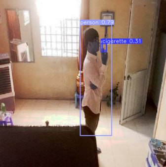

# NuclearHack_Cross_Degradation
RZD case for Nuclear IT hack fall spring 2024

Problem: recognizing smokers in inaproppriate for smoking places

#presentation
[ https://docs.google.com/presentation/d/1skxsDQddF9XH3TV9PmvUpdbo-fAE8pOuOEAPo41SxAU/edit?usp=sharing ]

#Usage
On web page you can test the model by uploading an image. Model prediction is given on a screen.

#Trainig
Model was trained on augmented data provided by problem authors.

#Testing
Tested on unseen non augmented data from same dataset

![smoking] (assets/smoker2.jpg)
